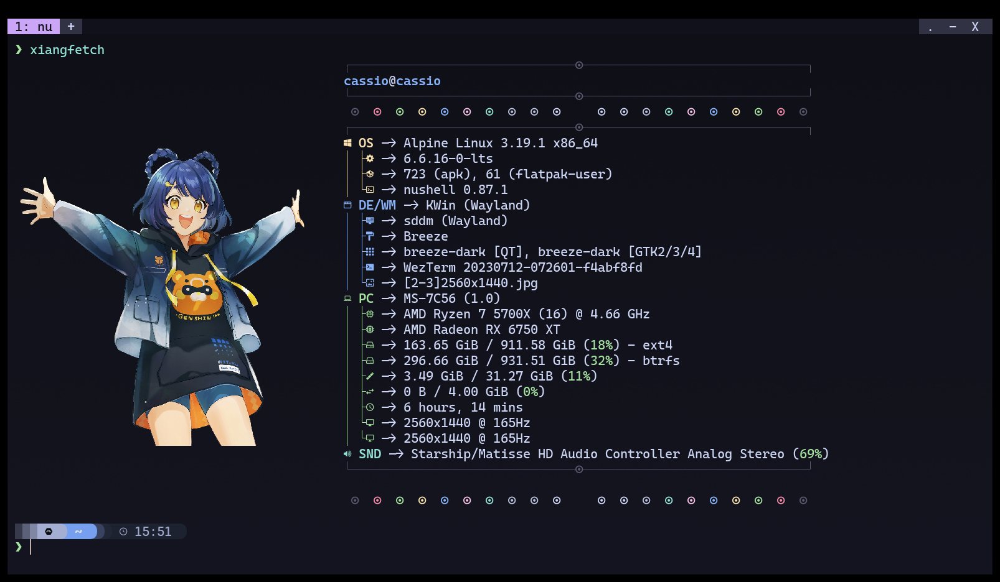

<h1 align="center">
  Fastfetch Config
</h1>

<h4 align="center">My fastfetch config files</h4>

<p align="center">
  <a href="#about">About</a> •
  <a href="#usage">Usage</a>

  <br><br>

  
</p>

## About

This repo is just for me tracking the config on another devices.

## Usage

Put the repo folder at the ``~/.local/share/`` and run some of the configs below:

```sh
fastfetch --config cobra
fastfetch --config linus
fastfetch --config ganyu
fastfetch --config xiangling
# To check more configs see presets folder
```
